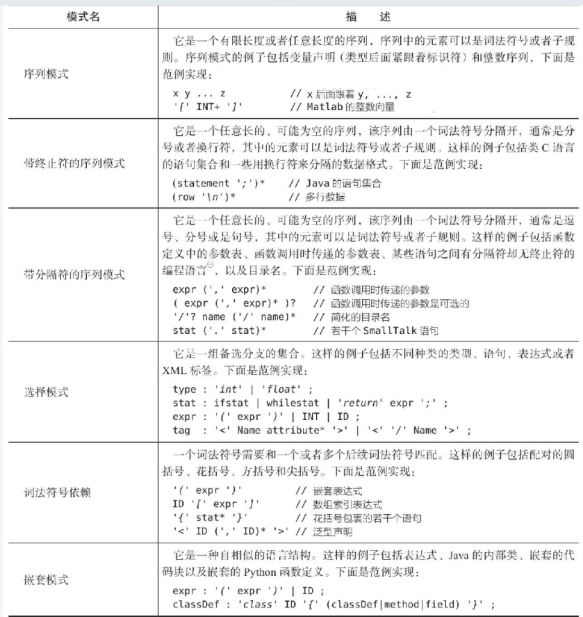

# 简介
ANTLR v4是一款强大的语法分析器生成器，可以用来读取、处理、执行和转换结构化文本或二进制文件。通过称为文法的形式化语言描述，ANTLR可以为该语言自动生成词法分析器。生成的语法分析器可以自动构建语法分析树，它是表示文法如何匹配输入的数据结构。ANTLR还可以自动生成树遍历器，用来访问树节点以执行特定的代码。

ANTLR v4的语法分析器使用一种新的称为Adaptive LL(*)或ALL(*)的语法分析技术，它可以在生成的语法分析器执行前在运行时动态地而不是静态地执行语法分析。

```sh
curl https://www.antlr.org/download/antlr-4.13.1-complete.jar -o /usr/local/lib/antlr-complete.jar
# 设置class
export CLASSPATH=".:/usr/local/lib/antlr-complete.jar:$CLASSPATH" 
# 1) 起别名
alias antlr4='java -jar /usr/local/lib/antlr-complete.jar'
# 2) 通过脚本
cat > /usr/local/bin/antlr4.sh <<EOF
#!/bin/sh
java -cp .:./antlr-complete.jar:$CLASSPATH org.antlr.v4.Tool $*
EOF
```

## 入门
识别像hello xxx 那样短语的简单语法:
```java
// Hello.g4
grammar Hello;               // 定义语法的名字
s  : 'hello' ID ;            // 匹配关键字hello，后面跟着一个标志符
ID : [a-z]+ ;                // 匹配小写字母标志符
WS : [ \t\r\n]+ -> skip ;    // 跳过空格、制表符、回车符和换行符
```

编译:
```sh
# 该命令会在相同目录下生成后缀名为tokens和java的六个文件：
antlr4 Hello.g4
# 编译
javac *.java

# TestRig使用Java反射调用编译后的识别器
alias grun= 'java org.antlr.v4.gui.TestRig'
grun Hello s -tokens
# -tokens 打印出记号流。
# -tree 以LISP风格的文本形式打印出语法分析树。
# -gui 在对话框中可视化地显示语法分析树。
# -ps file.ps 在PostScript中生成一个可视化的语法分析树表示，并把它存储在file.ps文件中。
# -encoding encodingname 指定输入文件的编码。
# -trace 在进入/退出规则前打印规则名字和当前的记号。
# -diagnostics 分析时打开诊断消息。此生成消息仅用于异常情况，如二义性输入短语。
# -SLL 使用更快但稍弱的分析策略。
```

## 基本概念
一门语言由有效的句子组成，一个句子由短语组成，一个短语由子短语和词汇符号组成。
识别语言的程序被称为语法分析器。语法指代控制语言成员的规则，每条规则都表示一个短语的结构。
把字符组成单词或符号（记号）的过程被称为词法分析或简单标记化。词法分析器能把相关的记号组成记号类型，记号至少包含两块信息：记号类型（确定词法结构）和匹配记号的文本。
语法分析树的内部节点是分组和确认它们子节点的短语名字。根节点是最抽象的短语名字, 语法分析树的叶子节点永远是输入记号

## 实现语法分析器
ANTLR工具根据语法规则，生成递归下降语法分析器
```java
// assign : ID '=' expr ;
void assign() {    // 根据规则assign生成的方法
    match(ID);     // 比较ID和当前输入符号然后消费
    match('=');
    expr();        // 通过调用expr()匹配表达式
}
```

## 语法分析树

ANTLR类分别是CharStream、Lexer、Token、Parser和ParseTree。连接词法分析器和语法分析器的管道被称为TokenStream
ParseTree的子类RuleNode和TerminalNode以及它们所对应的子树根节点和叶子节点
每个上下文对象知道被识别短语的开始和结束记号以及提供对所有短语的元素的访问

## 监听器和访问者
默认情况下，ANTLR生成一个语法分析树Listener接口，在其中定义了回调方法，用于响应被内建的树遍历器触发的事件。
在Listener和Visitor机制之间最大的不同是：Listener方法被ANTLR提供的遍历器对象调用；
而Visitor方法必须显式的调用visit方法遍历它们的子节点，在一个节点的子节点上如果忘记调用visit方法就意味着那些子树没有得到访问。

## 词法分析特性
+ 孤岛语法: 处理相同文件中的不同格式
+ 重写输入流: 源代码插桩或者重构
+ 将词法符号送入不同通道

# 语法
四种抽象的计算机语言模式
+ 序列, 即一列元素
+ 选择
+ 词法符号依赖: 一个词法符号需要和某处的另外一个词法符号配对
+ 嵌套结构: 一种自相似的语言结构, 如嵌套算术表达式或者嵌套语句块

antlr 提供可选方案,词法符号引用和规则引用(BNF), 划分成子规则(用括号包围的内)

语法由一个为该语法命名的头部定义和一系列可以相互引用的语言规则组成:
```java
/* Optional javadoc style comment*/
// 文件命名必须和grammar命名相同,如 grammar T,文件名必须命名为T.g4.
// options,imports,token,action的声明顺序没有要求,但一个文件中options,imports,token最多只能声明一次.
// grammar是必须声明的,同时必须至少声明一条规则(rule),其余的部分都是可选的.
grammer Name; 
options {…}; 
import …; 
tokens {…}; 
channels {…}; 
@actionName** {…}; 
rule1: <<stuff>> //parser and lexer rules 
… 
ruleN 
```



## 关键字

```sh
import, fragment, lexer, parser, grammar, returns, locals, 
throws, catch, finally, mode, options, tokens
```

引入(imports): 会从引入的文件继承所有的规则,词法单元,动作.然后主文件中的元素会”覆盖”引入文件中的重名元素.

## 注释(Comments)
支持单行注释,多行注释,和javadoc风格的注释

## 标识符(Identifiers)
词法单元和词法规则通常以大写字母命名
解析规则(parser rule) 以小写字母开头命名(驼峰命名法)

## 文字(Literals)
ANTLR不区分字符和字符串.所有的字符串都是由单引号引用起来的字符,但是像这样的字符串中不包括正则表达式.支持unicode和转义符号

## 动作(Actions)
动作是用目标语言书写的代码块.嵌入的代码可以出现在:
+ @header @members这样的命名动作中
  + `@header` 在生成的目标代码中的类定义之前注入代码
  + `@members` 在生成的目标代码中的类定义里注入代码(例如类的属性和方法)
+ 解析规则和词法规则中
+ 异常捕获中
+ 解析规则的属性部分(返回值,参数等)
+ 一些规则可选元素中

## 规则(rules)

```sh
ruleName : alternative1 | ... | alternativeN ;
# 定义类型
type : 'int' | 'unsigned' | 'long'
```

### 子规则
规则中包含的可选块称为子规则(被封闭在括号中).子规则也可以看做规则(rule),但是没有显式的命名.子规则不能定义局部变量,也没有返回值.如果子规则只有一个元素,括号可以省略.

```sh
(x|y|z) 只匹配一个选项
(x|y|z)? 匹配一个或者不匹配
(x|y|z)* 匹配零次或多次
(x|y|z)+ 匹配一次或多次
```

## 词法单元

```sh
tokens {Token1 ... TokenN}
```

## 处理优先级, 左递归和结合性
+ 隐式指定优先级: 通过选择位置靠前的备选分支来解决歧义问题
+ 结合性: 默认是左结合, 通过 assoc 指定
+ 左递归: 在某个备选分支的最左侧以直接或者间接方式调用了自身

```sh
expr: <assoc=right> expr '^' expr 
    | INT
    ;
```

## 常见词法结构
ANTLR将为字符串常量隐式生成的词法规则放在显式定义的词法规则之前，所以它们总是拥有最高的优先级。

```sh
# 匹配标识符
ID: ('a'..'z' | 'A'..'Z')+;
ID: [a-zA-Z]+;
STRING: '"' (ESC|.)*? '"';
# 匹配转义
ESC: '\\"' | '\\\\'; 

# 匹配注释和空白字符
assign: ID (WS|COMMENT)? '=' (WS|COMMENT) expr (WS|COMMENT)?; # WS 空白字符
# skip指令 通知丢弃
LINE_COMMENT: '//' .*? '\r'? '\n' -> skip;
COMMENT: '/*' .*? '*/' -> skip;
WS: [\t\r\n]+ -> skip;
```

# 解析器规则(Parser Rules)
解析器由一组解析器规则组成.java应用通过调用生成的规则函数(每个规则会生成一个函数)来启动解析.

```sh
stat : restat | 'break' ';' | 'continue' ';' ;
```

## 可选标签(Alternative Labels)
可以在规则中添加标签,ANTLR会根据标签生成与规则相关的解析树的事件监听函数,可以更加精准的控制解析过程.用 `#`` 操作符定义一个标签
```sh
grammar T;
stat: 'return' e ';' # Return
    | 'break' ';' # Break
```

ANTLR会为每个标签生成一个rule-context类: 
```java
public interface AListener extends ParseTreeListener {
 	void enterReturn(AParser.ReturnContext ctx);
 	void exitReturn(AParser.ReturnContext ctx);
 	void enterBreak(AParser.BreakContext ctx);
 	void exitBreak(AParser.BreakContext ctx);
}
```

## 规则上下文对象(Rule Context Objects)
ANTLR为每个规则生成一个上下文对象,通过这个对象可以访问规则定义中的其他规则的引用
根据规则定义中的其他规则的引用数量不同,生成对象中包含的方法也不同

## 规则元素标签(Rule Element Labels)
可以用 `=` 操作符为规则中的元素添加标签,这样会在规则的上下文对象中添加元素的字段.
`+=` 操作符可以很方便的记录大量的token或者规则的引用

## 规则元素(Rule ELements)
规则元素指定了解析器在具体时刻应该执行什么任务.元素可以是规则(rule), 词法单元(token), 字符串文字(string literal)等
+ T token
+ ‘literal’ 字符串文字
+ r 规则
+ r[args] 向规则函数中传递参数,参数的书写规则是目标语言,用逗号分隔
+ . 通配符
+ {action} 动作,在元素的间隔中执行
+ {p} 谓词
+ 支持逻辑非操作符:~

## 捕获异常(Catching Exception)
当规则中出现语法错误,ANTLR可以捕获异常,报告错误和尝试恢复(possibly by consuming more tokens),然后从规则中返回.
ANLTR通过策略模式来处理所有的异常,也可以为某个规则通过指定特定的异常处理:在规则末尾添加catch语句.

```java
r : ...
 	; 
 	catch[RecognitionException e] { throw e; }
```

## 规则属性定义(Rule Attribute Definition)
可以像编程语言中的函数那样,在规则中定义参数,返回值,局部变量,定义的这些属性会保存在规则上下文对象中(rule context object).

```java
rulename [args] returns [retvals] locals [localvars]: ...;
//[..]中定义的变量可以在定义之后使用
add [int x] returns [int result] : '+=' INT {$result = $x + $INT.int;};
```

和语法层面的动作(action)一样,可以定义规则层面的动作.合法的动作名是:init,after.像这些动作的命名一样,
解析器会在匹配相应的规则之前执行init动作,在规则匹配完成之后执行after动作.

```java
/** Derived from rule "row : field (',' field)* '\r'? '\n' ;" */
row[String[] columns] returns [Map<String,String> values]
locals [int col=0]
@init {
a$values = new HashMap<String,String>();
}
@after {
    if ($values!=null && $values.size()>0) {
        System.out.println("values = "+$values);
    }
}
```

## 数据传递
+ 访问器方法来返回值
+ 类成员在事件方法之间共享数据
+ 通过对语法分析树的节点进行标注来存储相关数据

# 高级特性

## 错误报告与恢复
ANTLR提供的优秀的错误报告功能和复杂的错误恢复机制。ANTLR生成的语法分析器能够自动地在遇到句法错误时产生丰富的错误消息，并且能在大多数情况下成功地完成重新同步。

可以通过实现接口 `ANTLRErrorListener` 来改变错误消息的目标输出和内容
+ 语法分析器会试图在子规则的识别之前和识别过程中进行重新同步(resynchronize)
+ 允许开发者按照策略模式(Strategy pattern)指定自定义的错误处理机制

错误恢复指的是允许语法分析器在发现语法错误后还能继续的机制
+ 通过扫描后续词法符号来恢复
+ 从不匹配的词法符号中恢复
+ 从子规则的错误中恢复
+ 捕获失败的语义判定
+ 错误恢复机制的防护措施

## 属性和动作
动作就是使用目标语言(即ANTLR生 成的代码的语言)编写的、放置在 `{..}` 中的任意代码块。可以在动作中编写任意代码，只要它们是合法的目标语言语句。
动作的典型用法是操纵词法符号和规则引用的属性(attribute)

## 使用语义判定修改语法分析过程
语义判定: `{..}?`，称为，允许在运行时选择性地关闭部分语法
+ 判定本身是布尔表达式，它会减少语法分析器的在语法分析过程中可选项的数量
+ 需要语法分析器处理同一门编程语言稍有差异的多个版本
+ 处理语法的歧义性

## 掌握词法分析的“黑魔法”
+ 将词法符号送入不同通道
+ 上下文相关的词法问题
+ 字符流中的孤岛

# 参考文档

## 探究运行时API
+ `org.antlr.v4.runtime`: 该包包含了最常用的类和接口，例如与输入流、字符和词法符号缓冲区、错误处理、词法符号构建、词法分析和语法分析相关的类体系结构。
+ `org.antlr.v4.runtime.atn`: 该包在ANTLR内部用于自适应LL (*)词法分析和语法分析策略。包名中的atn是增强转移网络(argumented transition network)，它是一种能够表示语法的状态机，其中网络的边代表语法元素。在词法分析和语法分析的过程中，ANTLR沿ATN移动，并基于前瞻符号作出预测。
+ `org.antlr.v4.runtime.dfa`: 使用ATN进行决策的代价很高，因此ANTLR在运行过程中将预测结果缓存在了确定有限状态自动机。该包包含了所有的DFA实现类。
+ `org.antlr.v4.runtime.misc`: 该包包含各种各样的数据结构，以及最常用的TestRig类
+ `org.antlr.v4.runtime.tree`: 默认情况 下，ANTLR自动生成的语法，分析器会建立语法分析树，该包包含实现此功能所需的全部类和接口。这些类和接口中还包括基本的语法分析树监听器、遍历器以及访问器机制。
+ `org.antlr.v4.runtime.tree.gui`: ANTLR自 带一个 基本的语法分析树查看器，可通过inspect方法访问。也可以通过save方法将语法分析树保存为PostScript格式。TestRig的“ -gui”选项亦会启动该查看器。

### 识别器
ANTLR自动生成的词法分析器和语法分析器是 `Lexer` 和 `Parser` 的子类。Recognizer基类抽象了识别字符序列或词法符号序列中语言结构的概念。识别器(Recognizer) 的数据来源是IntStream。
Lexer实现了接口TokenSource,后者包含两个核心的词法分析器方法: nextToken 、getLine getCharPositionInLine。
在最高层次的抽象中，词法分析器和语法分析器的主要工作都是分析整数输入流。词法分析器处理字符(短整数型) ，语法分析器处理词法符号类型(整数型)。

## 移除直接左递归

# 参考
+ ANTLR4权威指南
  + [参考代码](https://github.com/DropYearning/ANTLR4_Reference)
+ [ANTLR 4简明教程](https://www.bookstack.cn/books/antlr4-short-course)
+ [Antlr4系列（二）：实现一个计算器](https://zhuanlan.zhihu.com/p/546679086)
+ [antlr4 doc](https://github.com/antlr/antlr4/blob/dev/doc/getting-started.md)
+ [Grammars written for ANTLR v4](https://github.com/antlr/grammars-v4)