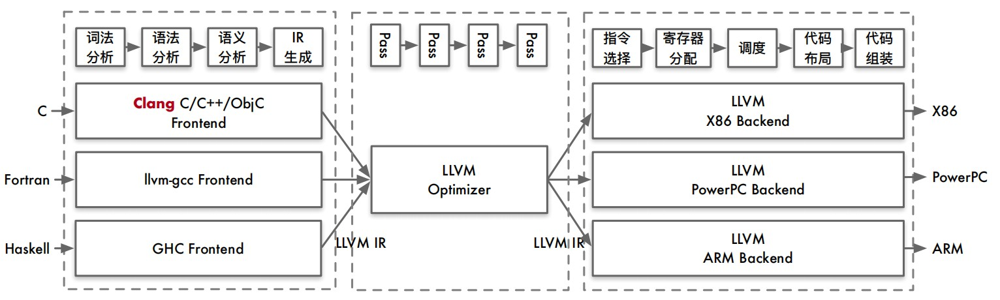
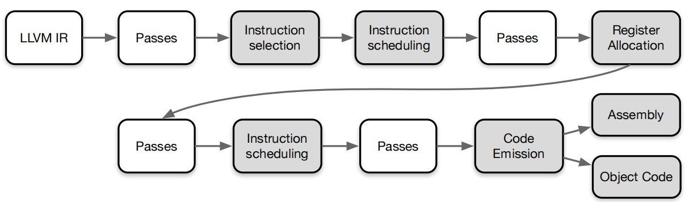

# 简介
LLVM开始的目标是提供提一个现代化的、基于SSA编译策略的、同时支持静态和动态编译任何编程语言的编译器架构。

LLVM项目发展为一个巨大的编译器相关的工具集合。实际上，名字LLVM可能表示如下含义：
+ LLVM项目/基础设施：这是指若干项目的集合，一起构成一个完整的编译器：前端，后端，优化器，汇编器，链接器，libc++，compiler-rt，JIT引擎
+ 基于LLVM的编译器：这是指部分或者完全地由LLVM基础设施构建的编译器。举例来说，一个编译器可能用LLVM作前端和后端，但是用GCC和GNU系统库执行最终链接
+ LLVM程序库：这是指LLVM基础设施的可重用代码部分
+ LLVM核心：中间表示优化和后端算法构成LLVM核心，这是项目最初的起点
+ LLVM IR(Intermedaite Representation)：这是LLVM编译器的中间表示

## 应用
+ 模拟器
+ 类似于Pin的动态二进制检测工具
+ 源码级转换（从简单的东西sed到涉及 AST 解析和序列化的更完整的工具）
+ 破解内核以拦截系统调用
+ 任何类似于管理程序的东西

编译器
+ XLA（加速线性代数）是一种针对特定领域的线性代数编译器，能够加快 TensorFlow 模型的运行速度，而且可能完全不需要更改源代码
+ JAX 是Autograd和XLA的结合,JAX 本身不是一个深度学习的框架,他是一个高性能的数值计算库,更是结合了可组合的函数转换库,用于高性能机器学习研究
+ TensorFlow是一个端到端开源机器学习平台。它拥有一个全面而灵活的生态系统，其中包含各种工具、库和社区资源，可助力研究人员推动先进机器学习技术
+ TVM 端到端深度学习编译器,从现有框架中取得 DL 程序的高层级表示，并产生多硬件平台后端上低层级的优化代码，其目标是展示与人工调优的竞争力
+ Julia使用 LLVM JIT编译。LLVM JIT 编译器通常不断地分析正在执行的代码，并且识别代码的一部分，使得从编译中获得的性能加速超过编译该代码的性能开销

# LLVM架构
+ 前端：这是一个编译阶段，它将计算机编程语言（例如C，C++，Objective-C）翻译为LLVM编译器IR。它包含词法分析器，语法解析器，语义分析器，和LLVM IR代码生成器。Clang项目实现了全部前端相关的步骤，同时提供了插件接口和一个单独的静态分析器工具，用于深度分析
+ IR：LLVM IR既有人类可读形式，又有二进制编码形式。很多工具和程序库提供了用于构建、汇编、反汇编IR的接口。LLVM优化器也操作IR，大部分优化在此发生
+ 后端：这是负责代码生成的编译阶段。它将LLVM IR变换为机器特定的汇编代码或目标代码二进制。寄存器分配、循环转换、窥孔优化、机器特定的优化/转换等属于后端



## 编译器组件
交互方式
+ 在内存中：这种方式通过一个总管工具（例如Clang）发生，每个LLVM组件都是它的程序库，根据分配在内存中的数据结构，将一个阶段的输出作为输入传送给下一个阶段
+ 通过文件：这种方式通过小型的独立工具发生，用户运行一个独立工具，它将一个特定组件的结果写到磁盘上的一个文件，接着用户运行下一个独立工具，它以这个文件为输入

## 库
LLVM和Clang逻辑被精心地组织成如下的程序库：
+ libLLVMCore：包含所有LLVM IR相关的逻辑：IR构造（数据布局、指令、基本块、函数）和IR验证。它也提供Pass管理器
+ libLLVMAnalysis：包含若干IR分析Pass，例如别名分析、依赖分析、常量合并、循环信息、内存依赖分析、指令简化等
+ libLLVMCodeGen：实现了目标无关的代码生成和机器层次（低层版本LLVM IR）的分析和转换
+ libLLVMTarget：通过通用目标抽象，提供对目标机器信息的访问。libLLVMCodeGen实现了通用后端算法，而高层抽象为两者提供了交流的通道
+ libLLVMX86CodeGen：包含x86目标特定的代码生成信息、转换和分析Pass，它们组成了x86后端。注意，每个机器目标都有自己不同的库
+ libLLVMSupport：包含一组常用的实用工具。错误处理、整数和浮点数处理、命令行解析、调试、文件支持、字符串操作等
+ libclang：它实现一套C接口（对比C++，LLVM代码的默认实现语言）以暴露Clang的前端功能——诊断报告、AST遍历、代码补全、光标和源代码间映射。C接口相当简单，使得采用其它语言（例如Python）的项目能够容易地使用Clang的功能，尽管用C设计接口是为了更稳定，并让外部项目能够利用它。它仅覆盖内部LLVM组件所用的C++接口的子集
+ libclangDriver：它包含一套C++类，编译器驱动器利用它们理解类GCC的命令行参数，以准备编译任务，为外部工具组织适当的参数，以完成编译的不同步骤。根据目标平台，它可以采用不同的编译策略
+ libclangAnalysis：这是一系列Clang提供的前端层次分析。它的特性诸如构造CFG和调用图、可达代码、安全格式化字符串等

# 安装

```sh
# sudo apt-get install -y llvm clang
# clang -v

# https://apt.llvm.org/
sudo bash -c "$(wget -O - https://apt.llvm.org/llvm.sh)"
```

# clang 
Clang可能指代三种不同的实体：
+ 前端（由Clang程序库实现）
+ 编译器驱动器（由clang命令和Clang驱动器程序库实现）, 包括为调用编译器准备所有必需的参数
+ 实际的编译器（由clang -cc1命令实现）。clang -cc1中的编译器不单用Clang程序库实现，还大量地用到了LLVM程序库以实现编译器的中端和后端，还有集成的汇编器

## 使用
Clang编译器驱动器被设计成跟GCC的参数和命令结构相兼容
```sh
# -S 汇编
clang -S test.c -o test-64bit.S
# 可执行文件， -### 查看 调用的所有后续工具
clang -### mian.c -o main
clang -ccc-print-phases main.c
# 生成LLVM bitcode, -c用目标机器语言生成目标文件
# 方式一：
clang -emit-llvm -S -c main.c -o main.ll
# 参数-filetype=obj指定输出目标文件，而不是输出目标汇编文件
llc -filetype=obj main.bc -o main.o
# 利用Clang驱动器，clang，来调用链接器
clang main.o -o main

# 方式二：
clang -emit-llvm -c main.c -o main.bc
llvm-link main.bc -o main.linked.bc
# 调用后端（llc）之前链接IR文件，使得opt工具提供的链接时优化能够进一步优化最终产生的IR
llc -filetype=obj main.linked.bc -o main.linked.o
clang main.linked.o -o main

# 打印 词法分析 token 
clang -cc1 -dump-tokens main.c
# 打印Clang抽象语法树
clang -Xclang -ast-dump main.c
clang -cc1 -ast-dump main.c
# 图形视图
clang -fsyntax-only -Xclang -ast-view main.c

# 选择使用PCH文件时，所有头文件都被预编译成单个PCH文件，在编译一个翻译单元时，编译器快捷地从预编译的头文件得到信息
clang -x c-header myheader.h -o myheader.h.pch
```

## 理解Clang AST节点
一个AST节点表示声明、语句、类型。因此，有三个表示AST的核心类：Decl、Stmt、Type。

# Pass
Pass类是实现优化的主要资源，一般通过清楚的子类使用它。当实现一个Pass时，应该选择适合的Pass的最佳粒度，适合此粒度的最佳子类，例如基于函数、模块、循环、强联通区域。优化通常由分析 Pass 和转换 Pass 组成
+ 分析 Pass：负责发掘性质和优化机会
+ 转换 Pass：生成必需的数据结构，后续为后者所用
+ 显式依赖：转换Pass需要一种分析，则Pass管理器自动地安排它所依赖的分析Pass在它之前运行
+ 隐式依赖：转换或者分析Pass要求IR代码运用特定表达式。需要手动地以正确的顺序把这个Pass加到Pass队列中，通过命令行工具（clang或者opt）或者Pass管理器

用户可以自己选择不同的pass，重写默认实现或者增加自己的pass。这种组装的灵活性让用户不必从头实现Code Generator。
对于不同平台不同的地方， LLVM提供了目标表述文件（.td 文件）。LLVM使用tblgen工具来处理这些描述文件

# LLVM Backend Pass
整个后端流水线用到了四种不同层次的指令表示：
+ 内存中的LLVM IR，SelectionDAG 节点，MachineInstr，和 MCInst
+ 内存中 LLVM IR 变换为目标特定 SelectionDAG 节点
+ 每个DAG能够表示单一基本块的计算
+ 节点表示指令，而边编码了指令间的数据流依赖
+ 让LLVM代码生成程序库能够运用基于树的模式匹配指令选择算法



Instruction Scheduling 指令调度
+ 第1次指令调度（Instruction Scheduling），也称为前寄存器分配（RA）调度
+ 对指令排序，同时尝试发现尽可能多的指令层次的并行
+ 然后指令被变换为MachineInstr三地址表示

Register Allocation 寄存器分配
+ LLVMIR 两个中哟特性之一：LLVM IR 寄存器集是无限
+ 这个性质一直保持着，直到寄存器分配（Register Allocation）
+ 寄存器分配将无限的虚拟寄存器引用转换为有限的目标特定的寄存器集
+ 寄存器不够时挤出（spill）到内存

Instruction Scheduling 指令调度
+ 第2次指令调度，也称为后寄存器分配（RA）调度
+ 此时可获得真实的寄存器信息，某些类型寄存器存在延迟，它们可被用以改进指令顺序

Code Emission 代码输出
+ 代码输出阶段将指令从 MachineInstr 表示变换为 MCInst 实例；
+ 新的表示更适合汇编器和链接器，可以输出汇编代码或者输出二进制块特定目标代码格式

# 参考
+ [写给入门者的LLVM介绍](https://zhuanlan.zhihu.com/p/472813616)
+ [LLVM后端开发书籍或文章整理](https://zhuanlan.zhihu.com/p/645857966)
+ [llvm 中文文档](https://llvm.liuxfe.com/)
+ [LLVM项目](https://www.cnblogs.com/lqerio/p/16009042.html)

## 系列博客
+ [LLVM 编译器](https://csstormq.github.io/)
+ [LLVM 后端实践笔记](https://zhuanlan.zhihu.com/p/351848328)
+ [用LLVM写一个芯片编译器](https://zhuanlan.zhihu.com/p/474933058)
+ [Deep Learning System core principles introduction.](https://github.com/chenzomi12/DeepLearningSystem)

## 书籍
