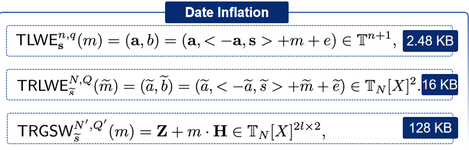

# 编译

```sh
git clone https://github.com/virtualsecureplatform/TFHEpp

# 忽略警告
set(CMAKE_CXX_FLAGS "${CMAKE_CXX_FLAGS} -w")
set(CMAKE_C_FLAGS "${CMAKE_C_FLAGS} -w")
```

# 数据定义



# 运算
|Instructions | example |	
| ---- | ---- |
|Exterprod | c = Exterprod（A, b）|
|CMUX  |	c = CMUX (C, a, b) |
|HomNAND |	c = HomNAND (a, b) |
|HomNOT	 | -a = HomNOT (a) |
|HomAND	|  |
|HomOR	|  |
|HomXOR	|  |
|CirBootstrap |	A = CirBootstrap (a) |
|Add	|  |
|Subtraction |	|
|Modular add | |	
|Modular sub | |